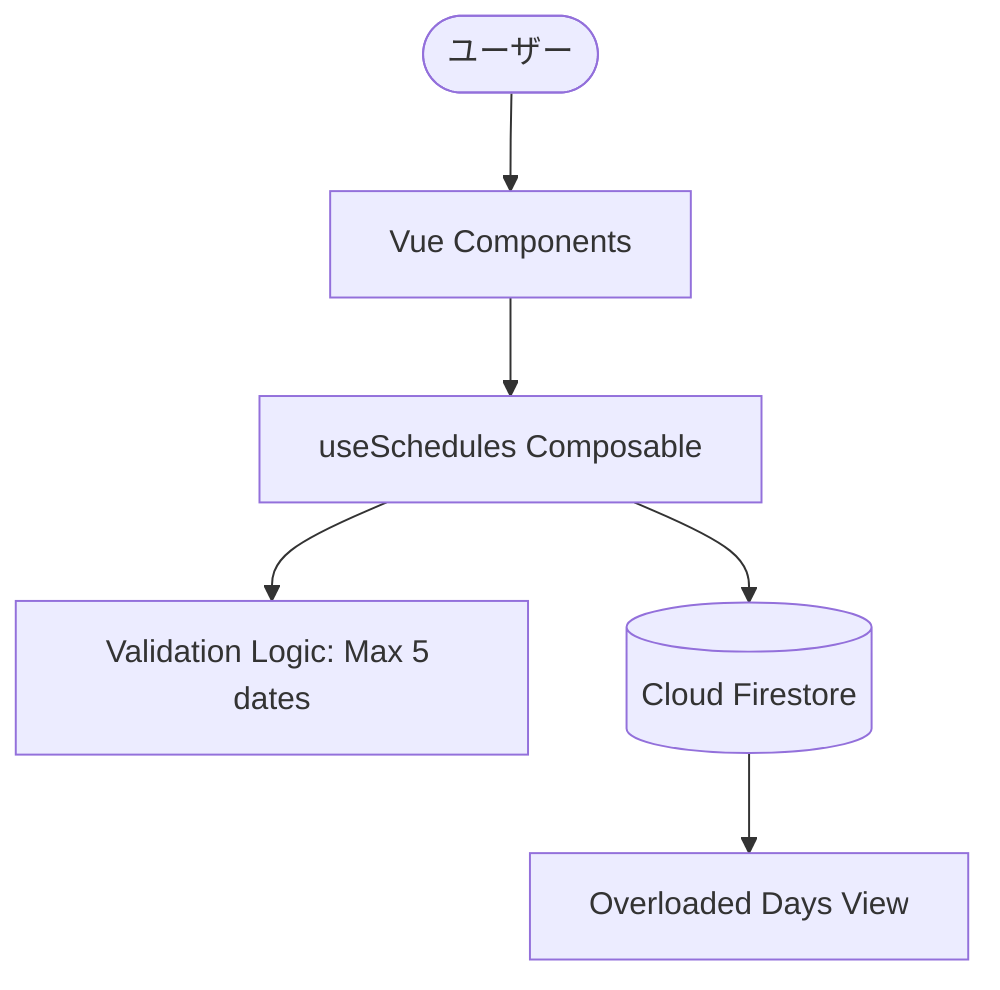

# 設計書 (Design Document)

## 概要
本設計は、案件ごとのスケジュール登録・候補日管理、および全案件を横断した過密スケジュールの抽出ロジックを定義するものです。フロントエンドの Nuxt 4 とバックエンドの Firebase (Auth/Firestore) を密接に連携させ、サーバーレスかつリアルタイムなユーザー体験を提供します。

## 指針ドキュメントとの整合性 (Steering Document Alignment)

### 技術標準 (tech.md)
- **Nuxt 4 & TypeScript**: 厳格な型定義により、候補日の最大数（5件）やステータスの整合性をコンパイルレベルで保証します。
- **Firebase SDK**: クライアントサイドでの直接通信を採用し、Firebase Sparkプランの範囲内で動作するアトミックな書き込み操作を標準とします。

### プロジェクト構造 (structure.md)
- **レイヤーの分離**: UIコンポーネントは `app/components`、データ操作とバリデーションロジックは `app/composables` に集約し、ビジネスロジックをUIから完全に分離します。
- **命名規約**: すべてのファイルおよび変数名は、プロジェクト構造ドキュメントで定義された `PascalCase`（コンポーネント）および `camelCase`（ロジック）に従います。

## コード再利用分析

### 活用する既存コンポーネント
- **Firebase Plugin**: `plugins/firebase.client.ts` を通じて初期化された Auth/Firestore インスタンスをすべてのデータ操作で再利用します。
- **Custom Composables**: `useAuth`（認証状態管理）を基盤として、`useSchedules`（スケジュール操作）を構築します。

### 統合ポイント (Integration Points)
- **Firestore**: `projects` コレクションと `schedules` 子コレクションをリレーショナルに扱い、案件ごとのフィルタリングを実現します。
- **Vercel**: デプロイメントパイプラインを統合し、環境変数経由で Firebase Config を安全に注入します。

## アーキテクチャ

### モジュール設計の原則
- **単一ファイルの責任**: 予定の「表示」を担うコンポーネントと、データの「更新」を担うコンポーザブルを分離します。
- **コンポーネントの分離**: スケジュール一覧、候補日選択、過密日アラートの各要素を独立した Vue コンポーネントとして実装します。
- **サービス層の分離**: Firestore へのクエリ発行ロジックを `composables` 内にカプセル化し、UI側からクエリの詳細を隠蔽します。

### データフローと依存関係


### 主要なデザインパターン
* **Repository Pattern (擬似的)**: `composables` がデータ取得と変換を担い、コンポーネントにはクリーンなデータ（型定義済みオブジェクト）のみを渡します。
* **Observer Pattern**: Firestore の `onSnapshot` を活用し、他デバイスでの予定確定をリアルタイムに UI へ反映させます。
* **Transaction / Batch Write**: 候補日の確定時に「ステータス更新」と「他候補の削除」を 1 つのバッチ処理として実行し、データの不整合を防止します。

### データモデル設計 (Firestore Schema)

#### `projects` コレクション
* `id`: string
* `name`: string
* `ownerId`: string (Firebase Auth UID)

#### `schedules` コレクション
* `id`: string
* `projectId`: string
* `title`: string
* `status`: 'candidate' | 'confirmed'
* `confirmedDate`: Timestamp | null
* `candidateDates`: Array<Timestamp> (Max 5 items)

### セキュリティ設計
* **Firestore Security Rules**:
  ```javascript
  allow read, write: if request.auth != null && request.auth.uid == resource.data.ownerId
  ```

### セキュリティ設計
* **認証ガード**: 認証済みかつ、リソースの所有者のみが操作可能なルールを徹底します。
